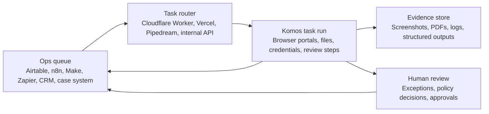

# Komos Regulated Ops Playbooks

Practical browser automation patterns for teams that run regulated back office work across CRAs, banks, insurance operations, and compliance teams.

Komos helps operations teams automate browser based work that still lives inside portals, legacy systems, downloaded files, and manual exception queues.

## Start Here

* [CRA background screening playbook](playbooks/cra-background-screening.md)
* [Insurance eligibility verification playbook](playbooks/insurance-eligibility-verification.md)
* [Banking operations reconciliation playbook](playbooks/banking-operations-reconciliation.md)
* [n8n regulated task queue template](templates/n8n-komos-regulated-task-queue.json)
* [Make scenario notes](integrations/make-regulated-task-queue.md)
* [Zapier Zap notes](integrations/zapier-regulated-task-queue.md)
* [Airtable operations queue schema](integrations/airtable-regulated-ops-queue.md)
* [Regulated task run JSON schema](schemas/regulated-task-run.schema.json)
* [Schema usage notes](schemas/README.md)
* [Regulated ops fixtures](fixtures/README.md)
* [GitHub Pages overview](https://xuanli.github.io/komos-regulated-ops-playbooks/)
* [Regulated operations partner review packet](https://xuanli.github.io/komos-regulated-ops-playbooks/regulated-operations-partner-review-packet.html)
* [Regulated ops vendor evaluation checklist](https://xuanli.github.io/komos-regulated-ops-playbooks/regulated-ops-vendor-evaluation-checklist.html)
* [Cloudflare Worker task router](examples/cloudflare-worker-task-router/README.md)
* [Vercel serverless task router](examples/vercel-task-router/README.md)

## Regulated Ops Playbook Matrix

| Team | Portal work Komos can run | Evidence to capture | Primary Komos page |
| --- | --- | --- | --- |
| CRA and background screening | County court searches, verification portals, adverse action notice queues, status checks | Screenshots, downloaded records, timestamps, portal messages, run logs | [Background screening automation](https://www.komos.ai/solutions/background-screening) |
| FCRA operations | Adverse action packet assembly, disclosure checks, notice status, queue routing | Notice artifacts, delivery status, exception reason, reviewer handoff notes | [FCRA adverse action automation](https://www.komos.ai/use-cases/fcra-adverse-action-automation) |
| Insurance eligibility | Payer portal eligibility checks, member lookup, benefit field extraction, prior authorization flags | Eligibility PDF, coverage status, copay, deductible, portal timestamp | [Insurance eligibility verification](https://www.komos.ai/use-cases/insurance-eligibility-verification) |
| Banking and finance ops | Statement retrieval, portal reconciliation, invoice status checks, exception queue cleanup | Statement files, reconciliation result, mismatch fields, audit screenshots | [Finance and banking operations](https://www.komos.ai/solutions/finance) |

## Reference Architecture



## Common Task Contract

The same request shape works across CRA, insurance, and banking queues. Keep sensitive fields in your system of record and send only the inputs needed for the portal task.

For validation in routers and queue integrations, use the shared [regulated task run JSON schema](schemas/regulated-task-run.schema.json).

```json
{
  "case_id": "CASE-100742",
  "workflow_type": "regulated_portal_check",
  "portal": "target_portal_name",
  "subject": {
    "external_id": "SUBJECT-123",
    "name": "Example Subject"
  },
  "return_fields": [
    "status",
    "evidence_url",
    "exception_reason",
    "next_action"
  ],
  "audit": {
    "source_system": "operations_queue",
    "requested_by": "ops-team@example.com"
  }
}
```

Recommended response fields:

| Field | Purpose |
| --- | --- |
| `status` | `completed`, `needs_review`, `blocked`, or `failed` |
| `evidence_url` | Link to the PDF, screenshot bundle, or run artifact |
| `exception_reason` | Deterministic category for human review routing |
| `next_action` | Queue action such as approve, review, retry, or request information |
| `completed_at` | UTC timestamp for audit reconstruction |

## Useful Komos Links

* [Komos homepage](https://www.komos.ai/)
* [Background screening automation](https://www.komos.ai/solutions/background-screening)
* [FCRA adverse action automation](https://www.komos.ai/use-cases/fcra-adverse-action-automation)
* [Insurance eligibility verification](https://www.komos.ai/use-cases/insurance-eligibility-verification)
* [Finance and banking operations](https://www.komos.ai/solutions/finance)
* [Browser automation tools](https://www.komos.ai/browser-automation-tools)
* [Komos API docs](https://docs.komos.ai/api-reference/introduction)

## Use Case Pattern

The same structure works across most regulated operations queues.

1. Intake a case from Airtable, HubSpot, Zendesk, n8n, Make, Zapier, or an internal system.
2. Send a Komos task run request with the case id, portal name, account reference, and required evidence fields.
3. Let Komos operate the browser workflow, handle portal specific steps, download evidence, and return structured output.
4. Write status, evidence links, exception reason, and audit fields back to the source queue.
5. Route exceptions to humans only when policy, missing credentials, or ambiguous portal state requires review.

## Where To Use These Examples

* Use the n8n template when a webhook should queue a Komos run from an operations workflow.
* Use the Make and Zapier notes when the source of truth is a no-code queue or CRM.
* Use the fixtures when validating request and result handling before connecting real CRA, insurance, or banking queues.
* Use the Cloudflare Worker or Vercel router when you need a lightweight API boundary around Komos task runs.
* Use the playbooks when a reviewer needs to inspect the regulated workflow before approving a tool listing, ecosystem PR, or internal automation design.

## Why This Repo Exists

Regulated ops teams often have automation gaps that standard API integration cannot close. The last mile is still browser based, requires evidence capture, and changes often. These playbooks show how to wrap Komos around that last mile while keeping queue ownership in common operations tools.
